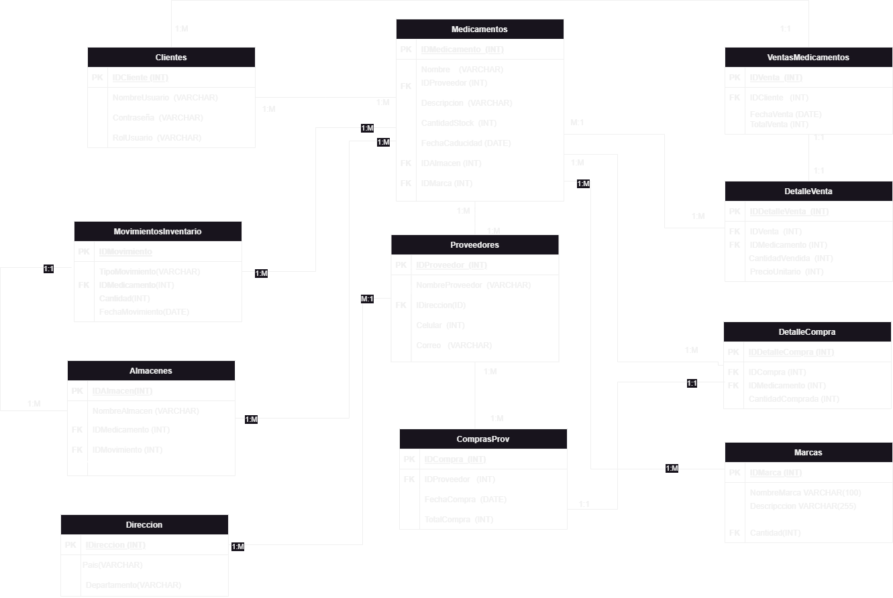

# **Segundo Parcial BD - Implementación  Nuevo Sistema De Administracion Para Los Medicamentos Controlados Para La Ceass**.👨‍⚕️🏥

## **Descripción de la entidad y los requisitos**🏢.

_La CEASS (Central de Abastecimiento y Suministros de Salud) es una institución destacada en el suministro de medicamentos esenciales en Bolivia. Su principal misión es garantizar el abastecimiento de medicamentos esenciales y suministros médicos de calidad, a precios asequibles, a todos los establecimientos de salud de los subsectores público y de la seguridad social de corto plazo en el país._

_Lo que se busca con esta propuesta es tener una base de datos la cual nos permita verificar y registrar los clientes, medicamentos, proveedores, ventas, compras, movimientos de almacenes, entre otros._

_Con el objetivo de automatizar y gestionar de manera eficiente los alamacenes, inventarios, registros, stocks de medicamentos. entre otros._

## **Diagrama Base Datos** ☁🤖.

## **Nuevos requerimientos**📓.
### **Triggers**🔫.
1. Trigger ActualizarStockDespuesDeCompra:

_Este trigger se activa después de insertar un nuevo registro en la tabla "DetalleCompra". Actualiza automáticamente la cantidad de stock en la tabla "Medicamentos" agregando la cantidad comprada del medicamento correspondiente._

        DELIMITER //
        CREATE TRIGGER ActualizarStockDespuesDeCompra
        AFTER INSERT ON DetalleCompra
        FOR EACH ROW
        BEGIN
        UPDATE Medicamentos
        SET CantidadStock = CantidadStock + NEW.CantidadComprada
        WHERE IDMedicamento = NEW.IDMedicamento;
        END //
        DELIMITER ;  

2. Trigger RegistrarFechaVenta:

_Este trigger se activa antes de insertar un nuevo registro en la tabla "Ventas". Establece automáticamente la fecha de venta ("FechaVenta") en el momento actual ("CURRENT_TIMESTAMP")._

        DELIMITER //
        CREATE TRIGGER RegistrarFechaVenta
        BEFORE INSERT ON Ventas
        FOR EACH ROW
        BEGIN
        SET NEW.FechaVenta = CURRENT_TIMESTAMP;
        END;
        //
        DELIMITER ;

3. Trigger VerificarStockVenta:

_Este trigger se activa antes de insertar un nuevo registro en la tabla "DetalleVenta". Verifica si la cantidad vendida en el nuevo registro es mayor que el stock actual del medicamento correspondiente en la tabla "Medicamentos". Si no hay suficiente stock, se genera una excepción indicando que no se puede realizar la venta._

        DELIMITER //
        CREATE TRIGGER VerificarStockVenta
        BEFORE INSERT ON DetalleVenta
        FOR EACH ROW
        BEGIN
        DECLARE stock_actual INT;
        SET stock_actual = (SELECT CantidadStock FROM Medicamentos WHERE IDMedicamento = NEW.IDMedicamento);
        IF NEW.CantidadVendida > stock_actual THEN
        SIGNAL SQLSTATE '45000' SET MESSAGE_TEXT = 'No hay suficiente stock para realizar la venta';
        END IF;
        END//
        DELIMITER ;

4. Trigger VerificarRolClienteVenta.

_Este trigger se activa antes de insertar un nuevo registro en la tabla "Ventas". Verifica el rol del cliente ("Rol") asociado al ID del cliente en la tabla "Clientes". Si el rol no es "Vendedor", se genera una excepción indicando que el cliente no tiene permisos para realizar una venta._

        DELIMITER //
        CREATE TRIGGER VerificarRolClienteVenta
        BEFORE INSERT ON Ventas
        FOR EACH ROW
        BEGIN
        DECLARE cliente_rol VARCHAR(50);
        SET cliente_rol = (SELECT Rol FROM Clientes WHERE IDCliente = NEW.IDCliente);
        IF cliente_rol <> 'Vendedor' THEN
        SIGNAL SQLSTATE '45000' SET MESSAGE_TEXT = 'El cliente no tiene permisos para realizar una venta';
        END IF;
        END //
        DELIMITER ;

5. Trigger ValidarStockMinimo_Insert.

_Este trigger se activa antes de insertar un nuevo registro en la tabla "Medicamentos". Verifica si el nuevo valor de "CantidadStock" está por debajo del límite mínimo establecido (10 en este caso). Si es así, se genera una advertencia indicando que el stock está por debajo del límite mínimo._

        DELIMITER //
        CREATE TRIGGER ValidarStockMinimo_Insert
        BEFORE INSERT ON Medicamentos
        FOR EACH ROW
        BEGIN
        DECLARE stock_minimo INT;
        SET stock_minimo = 10; 
        IF NEW.CantidadStock < stock_minimo THEN
        SIGNAL SQLSTATE '45000'
        SET MESSAGE_TEXT = 'Advertencia: El stock está por debajo del límite mínimo.';
        END IF;
        END //

6. Trigger ValidarStockMinimo_Update.

_Este trigger se activa antes de actualizar un registro existente en la tabla "Medicamentos". Verifica si el nuevo valor de "CantidadStock" está por debajo del límite mínimo establecido (10 en este caso). Si es así, se genera una advertencia indicando que el stock está por debajo del límite mínimo._

        CREATE TRIGGER ValidarStockMinimo_Update
        BEFORE UPDATE ON Medicamentos
        FOR EACH ROW
        BEGIN
        DECLARE stock_minimo INT;
        SET stock_minimo = 10; 
        IF NEW.CantidadStock < stock_minimo THEN
        SIGNAL SQLSTATE '45000'
        SET MESSAGE_TEXT = 'Advertencia: El stock esta por debajo del limite minimo.';
        END IF;
        END //
        DELIMITER ;

### **Stored Procedures 💾**

1. Stored Procedure SP_BuscarMedicamentos.

_Este procedimiento recibe un criterio de búsqueda y devuelve una lista de medicamentos cuyo nombre o descripción coincidan parcialmente con dicho criterio._

        DELIMITER //
        CREATE PROCEDURE SP_BuscarMedicamentos (
        IN criterio VARCHAR(50)
        )
        BEGIN
        SELECT * FROM Medicamentos
        WHERE Nombre LIKE CONCAT('%', criterio, '%')
        OR Descripcion LIKE CONCAT('%', criterio, '%');
        END //
        DELIMITER ; 

2. Stored Procedure SP_BuscarProveedoresPorDireccion:

_Este procedimiento recibe criterios de búsqueda de país y departamento, y devuelve una lista de proveedores cuyas direcciones coincidan parcialmente con esos criterios._

        DELIMITER //
        CREATE PROCEDURE SP_BuscarProveedoresPorDireccion (
        IN criterio_pais VARCHAR(50),
        IN criterio_departamento VARCHAR(50)
        )
        BEGIN
        SELECT P.*
        FROM Proveedores P
        INNER JOIN Direccion D ON P.IDireccion = D.IDireccion
        WHERE D.Pais LIKE CONCAT('%', criterio_pais, '%')
                AND D.Departamento LIKE CONCAT('%', criterio_departamento, '%');
        END;//
        DELIMITER ;

3. Stored Procedure SP_ActualizarStock.

_Este procedimiento recibe un ID de medicamento y una cantidad, y actualiza el stock del medicamento sumando la cantidad especificada. Luego, devuelve los detalles actualizados del medicamento._

        DELIMITER //
        CREATE PROCEDURE SP_ActualizarStock (
        IN medicamentoID INT,
        IN cantidad INT
        )
        BEGIN
        UPDATE Medicamentos
        SET CantidadStock = CantidadStock + cantidad
        WHERE IDMedicamento = medicamentoID;

        SELECT * FROM Medicamentos WHERE IDMedicamento = medicamentoID;
        END;//
        DELIMITER ;

4. Stored Procedure SP_ReporteVentas.

_Este procedimiento recibe una fecha de inicio y una fecha de fin, y devuelve un informe de ventas que se realizaron dentro de ese período._

        DELIMITER //
        CREATE PROCEDURE SP_ReporteVentas (
        IN fechaInicio DATE,
        IN fechaFin DATE
        )
        BEGIN
        SELECT *
        FROM Ventas
        WHERE FechaVenta BETWEEN fechaInicio AND fechaFin;
        END;//
        DELIMITER ;

5. Stored Procedure SP_RegistrarVenta.

_Este procedimiento registra una venta en la base de datos. Recibe el ID del cliente, el ID del medicamento, la cantidad vendida, el ID de venta y el ID del detalle de venta. Inserta la venta en la tabla "Ventas", los detalles en la tabla "DetalleVenta", actualiza el stock del medicamento en la tabla "Medicamentos" y actualiza el total de la venta en la tabla "Ventas"._

        DELIMITER //
        CREATE PROCEDURE SP_RegistrarVenta (
        IN clienteID INT,
        IN medicamentoID INT,
        IN cantidad INT,
        IN IDVenta INT,
        IN IDDetalleVenta INT
        )
        BEGIN
        -- Insertar la venta en la tabla "Ventas"
        INSERT INTO Ventas (IDVenta, IDCliente, FechaVenta, TotalVenta)
        VALUES (IDVenta, clienteID, CURDATE(), 0); -- El campo "TotalVenta" se actualizará posteriormente

        -- Insertar los detalles de la venta en la tabla "DetalleVenta"
        INSERT INTO DetalleVenta (IDVenta, IDDetalleVenta, IDMedicamento, CantidadVendida)
        VALUES (IDVenta, IDDetalleVenta, medicamentoID, cantidad);

        -- Actualizar el stock del medicamento en la tabla "Medicamentos"
        UPDATE Medicamentos
        SET CantidadStock = CantidadStock - cantidad
        WHERE IDMedicamento = medicamentoID;

        -- Actualizar el total de la venta en la tabla "Ventas"
        UPDATE Ventas
        SET TotalVenta = (SELECT SUM(PrecioUnitario * CantidadVendida)
                        FROM DetalleVenta
                        WHERE IDVenta = IDVenta)
        WHERE IDVenta = IDVenta;
        END;//
        DELIMITER ;

## **Requisitos técnicos**🖥💻.
### Windows.
_Para ejecutar Docker Compose en Windows, necesitarás:_

* _Sistema operativo: Windows 10 64-bit: Pro, Enterprise o Education (con la versión 1607 o posterior) o Windows Server 2016.
* Docker Desktop: Debes tener instalado Docker Desktop para Windows. Puedes descargarlo e instalarlo desde el sitio web oficial de Docker.
* Git: Para poder clonar nuestro repositorio.  (https://git-scm.com/download/win)
### MAC.
_Para ejecutar Docker Compose en macOS (Mac), necesitarás:_

* Sistema operativo: macOS 10.13 o superior.
* Docker Desktop: Debes tener instalado Docker Desktop para macOS. Puedes descargarlo e instalarlo desde el sitio web oficial de Docker.
* Git: Para poder clonar nuestro repositorio. (https://git-scm.com/download/mac)

Es importante tener en cuenta que Docker Desktop incluye Docker Engine, Docker Compose y otras herramientas relacionadas. Una vez que hayas instalado Docker Desktop correctamente en tu sistema, podrás ejecutar comandos de Docker Compose en la línea de comandos de tu sistema operativo, ya sea Windows o macOS.

## **¿Cómo podemos levantarlo localmente? 🤓**

1. Abre una terminal o línea de comandos en tu sistema operativo.Clona el repositorio utilizando el siguiente comando:

        git clone https://github.com/GaboRex/bd_GabrielNeme.git

2. Guardalo en una carpeta nueva para evitar conflictos, localiza la misma y ejecuta un:

        cd <nombre_carpeta>
3. Verifica que el archivo docker-comp.yml y la carpeta master-scripts esten presentes en la carpeta. Puedes usar el siguiente comando para listar los archivos en la ubicación actual:

        ls
4. Una vez que te encuentres en la ubicación correcta del repositorio y el archivo docker-comp.yml y la carpeta master-cripts esten presentes, puedes ejecutar el siguiente comando para levantar los servicios definidos en tu archivo docker-comp.yml:

        docker-compose up

**OJO**

Esto solo funcionara si nos ecnontramos en ese directorio. Si es que no debemos ejecutar el mismo comando pero con la ruta correspondiente del archivo docker-comp.yml.

        docker-compose </ruta> up

5. Si deseas detener los servicios y eliminar los contenedores, puedes utilizar el siguiente comando en la terminal:

        docker-compose down

## Autor:✒️

* **Gabriel Neme** -[GaboRex](https://github.com/GaboRex)
* **Codigo:** 56189

